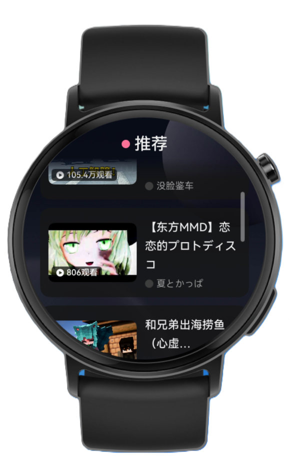
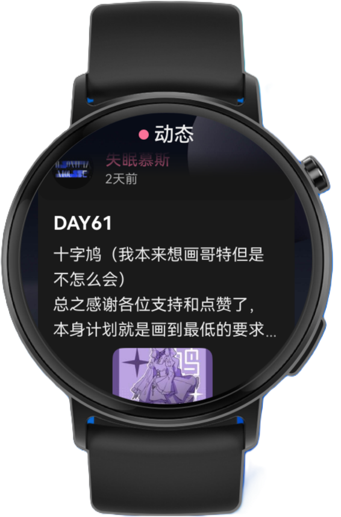

## **WitBili-OH**

第三方Bilibili鸿蒙手表客户端

### 介绍

一个运行在 HarmonyOS NEXT 手表上的第三方哔哩哔哩客户端，使用原生ArkTS开发，适配API 20+。

大量借鉴了[哔哩终端](https://github.com/PianoEthan/BiliTerminal)的UI设计 ~~（因为作者用哔哩终端已经用出肌肉记忆了）~~ 与部分API，**除此之外本项目与 其他第三方B站浏览软件 无任何关系，谢绝在无关评论区提及本项目。**

~~本项目大量使用Vibe Coding，代码质量仅限于能跑~~

### 截图

### 功能

* **推荐流** — 首页视频推荐 feed，支持下拉刷新
* **视频播放** — 基于 ijkplayer 的视频播放器，支持多种清晰度
* **弹幕** — 视频弹幕渲染与显示
* **搜索** — 视频与用户搜索，搜索历史
* **用户主页** — 查看用户信息、投稿视频列表
* **评论** — 视频评论浏览与发送
* **动态** — 关注用户的动态流与详情
* **专栏** — 专栏文章阅读
* **私信** — 会话列表与文本消息收发
* **扫码登录** — 命令行显示二维码，手机哔哩哔哩扫码登录
* **视频操作** — 点赞、投币、收藏

### 部分已知问题：

* **打开弹幕会导致视频很卡！**  目前仅作默认关闭弹幕处理，暂不修复
* **解码部分1080P视频会很卡！**  有可能是Kirin W80的锅，目前只能通过手动降分辨率解决

### 其它

作者是学生党，别催更，催了也没用。

并且由于阿B今年查得严，作者随时可能跑路（）

### 声明

本项目为第三方社区作品，与哔哩哔哩官方无关。仅供学习交流使用，请勿用于商业用途。

**开源软件声明**

本应用使用了由 Bilibili 开发的 ijkplayer 多媒体播放器鸿蒙版。

* **ijkplayer**

  * 版权所有 (c) 2003 Bilibili
  * 版权所有 (c) 2003 Fabrice Bellard
  * 版权所有 (c) 2013 Zhang Rui
  * 基于 LGPLv2.1 或更高版本协议发布。
* **FFmpeg**

  * 版权所有 (c) 2000-2024 the FFmpeg developers
  * 基于 LGPLv2.1 或更高版本协议发布。

### 

